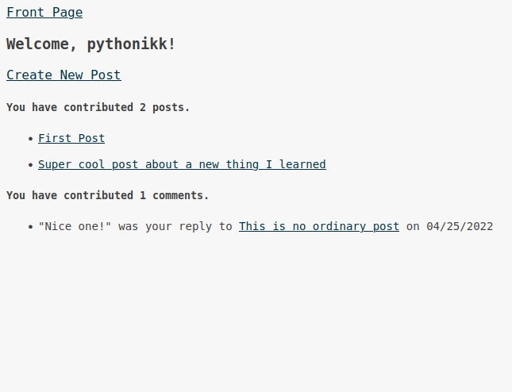

# Micro-Reddit

A project assigned by [The Odin Project](https://www.theodinproject.com/lessons/ruby-on-rails-micro-reddit). The goal was to put newely acquired active record knowledge to the test; building and running migrations, adding validations to the models, and using the correct associations between models.

Micro-Reddit implements a user, post, and comment models, with the obvious connections to one another-- user has many post and comments, post belongs to user, etc.

## Play

This assignment did not include front end, but I had a little extra time to play around with this one.

I implemented a user dashboard to demo the model objects having proper association, as seen here:

All code within controllers and views is purely experimental play and should not be referenced as proper rails code. Some notes in that regard:

-- The functionality of signing in is a fake, i haven't yet read about authentication, sessions, etc to implement a real user login. I made the decision here for the sign-in to always go to a particular user, just as a demo to get to the user's dashboard.

-- Signing up does create a new user, adding them to the database and redirecting to their dashboard.

-- I left off on building the functionality of creating a new post. The form is there, but it wouldn't save to the database as it doesn't attach the user's id, which the post model validates.
